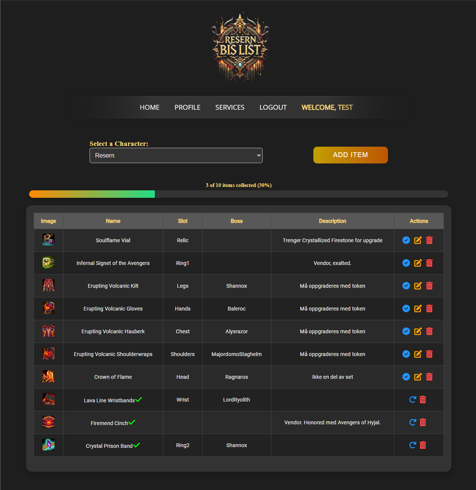
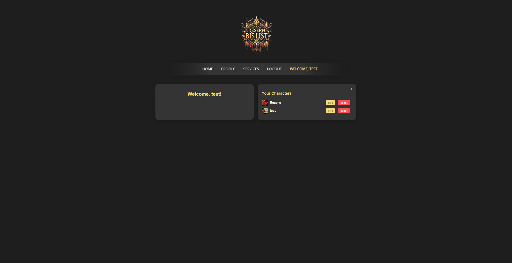
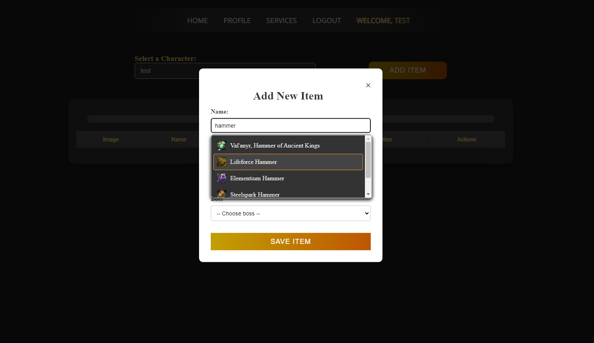
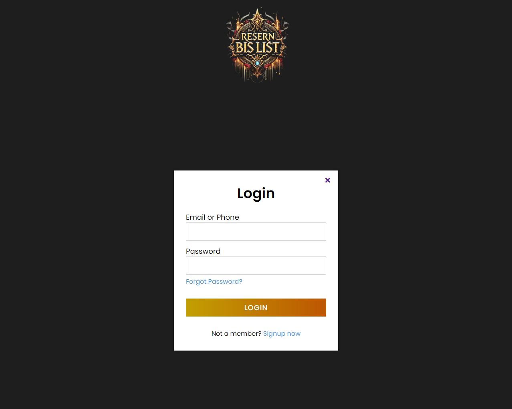

# Revz BIS List - World of Warcraft Item Tracker

## About the Project

**Revz BIS List** is a web application created for World of Warcraft players who want to track their **Best in Slot (BIS)** gear for their characters. The app allows users to add characters, manage BIS items, and mark items as collected. This gives players an easy way to visualize their progression towards full BIS gear.

https://www.revzbis.com/

_The project is actively maintained and being expanded with new features for the Mists of Pandaria Classic expansion._

### Preview Screenshots (Old logo)

**Home Page:**

**Profile Page:**

**Add Item Page:**

**Login Page:**

## Features

- 🔐 **User Registration & Login** – Secure authentication system
- 🎭 **Character Management** – Add, edit, and delete characters with class-specific icons
- 🎒 **Item Management** – Manage BIS items for each character
- ✅ **Track Progress** – Mark items as collected; visual progress bar shows BIS completion

## Technologies Used

### Backend

- Node.js
- Express.js
- PostgreSQL (Render)
- Sequelize ORM

### Frontend

- Current: EJS, HTML, CSS, JavaScript
- Planned: React + TypeScript
- Future: Migration to Next.js

### CI / Automation

GitHub Actions is used for continuous integration to automatically validate backend changes before merging. The CI pipeline runs on pull requests and pushes to main, and includes:

- Automated API tests using Jest and Supertest
- Session-based authentication testing (positive and negative cases)
- SQLite in-memory database for isolated test runs
- Verification of core backend flows (auth, characters, items)

This ensures that critical backend functionality is validated before changes are merged.

_Run all backend tests locally with:_ `npm test`

### Hosting

- Render (Backend + current frontend)
- Vercel (future React / Next.js deployment)

## Directory Structure

The project follows a clear and maintainable architecture:

- **.github/** – GitHub Actions workflows and CI configuration
- **data/** – Contains BIS item lists used for item search and selection
- **middleware/** – Authentication middleware (e.g., session handling and access control)
- **models/** – Sequelize models representing users, characters, and items
- **public/** – Static assets such as images, CSS, and frontend JavaScript
- **javascripts/** – Page-specific frontend logic for views like Home and Profile
- **routes/** – Express API endpoints for users, characters, items, and authentication
- **tests/** – Automated API tests (Jest + Supertest)
- **views/** – EJS templates used to render the UI before the upcoming React migration

## Roadmap

- **Improve and Secure User Registration and Login:** Implement enhanced security features and better user experience for authentication
- **Expansion-Specific Features:** Allow users to choose which expansion/version of the game they are playing, so items, bosses, and locations can be adapted accordingly
- **Share BIS List and Progress:** Let users share their BIS lists and progress with others
- **Expand Services:** Extend the application to include integrations such as Warcraftlogs, boss guides, and boss loot tables

## Contact

Have questions, suggestions, or feedback?
Reach out via GitHub or email.

---
