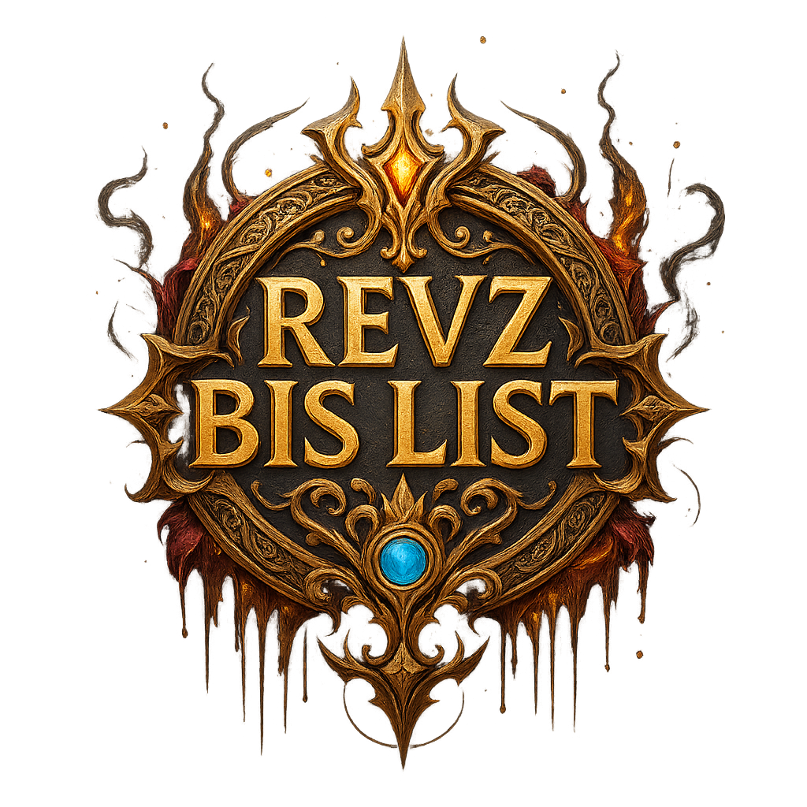

# Resern BIS List - World of Warcraft Item Tracker

## About the Project

**Resern BIS List** is a web application created for World of Warcraft players who want to keep track of their "Best in Slot" (BIS) gear for their characters. The application allows users to add characters, add BIS items for each character, and mark which items have been collected. This provides players with an easy way to visualize their progression for gear collection.

The application is now live and available at `www.resernbis.com`. Feel free to visit and try it out!

_Please note that this project is in its early stages and is still under active development. If you'd like to download and run your own local version, feel free to do so._

### How Resern BIS List Looks

**Home Page:**


**Profile Page:**


**Add Item Page:**


**Login Page:**


## Features

- **User Registration and Login**: Users can register, log in, and view their own list of characters.
- **Character Management**: Users can add, edit, and delete their characters with class-related icons.
- **Item Management**: Users can add, edit, and delete BIS items for each character.
- **Mark as Collected**: Users can mark items as collected, which updates the status and provides visual feedback.
- **Progress Display**: A progress bar shows how many items the user has collected for a selected character.

## Technologies Used

- **Backend**: Node.js with Express.js as the framework.
- **Database**: MySQL is used to store users, characters, and items.
- **Frontend**: HTML, CSS, JavaScript, and EJS (Embedded JavaScript) are used for the user interface.
- **JavaScript Functions**: JavaScript files for each page (home.js, profile.js, etc.) contain functionality for handling DOM manipulation, API calls, and the progress bar.

## Directory Structure

The project is organized to make it easy to expand and maintain:

- **config/**: Contains configuration files used for setting up database migrations. This includes details like database connection parameters used by the migration tool to create and modify tables.

- **data/**: Contains a list of all BIS items that players can add, which is used for searching specific items when pressing the "Add items" button in the application.

- **middleware/**: Contains middleware functions used in the application for authentication. For example, `auth.js` handles user login and verification using Passport.js to authenticate users.

- **migrations/**: Contains migration files used to create, update, or remove tables in the database. This is especially useful during development when the structure of the database needs to be adjusted.

- **models/**: Contains database models for various entities like users, characters, and items. These models are used to define and interact with the database, such as through Sequelize ORM.

- **public/**: Contains static content that is directly accessible by the client. This includes images, CSS files, and JavaScript files used for frontend styling and functionality.

- **javascripts/**: This folder contains frontend JavaScript files to manage functionality on specific pages. The folder is divided into `home` and `profile`, each subfolder having JavaScript files that handle the logic for that specific part of the application, like DOM manipulation and API calls.

- **routes/**: Contains all API endpoints for managing various functionalities, such as users, characters, and items. These files define how the server responds to HTTP requests for creating, reading, updating, and deleting resources.

- **services/**: Contains logic that is shared across different parts of the application, such as database queries or business logic that doesn't belong strictly to models or route handling. This helps maintain better code organization and reuse.

- **views/**: Contains EJS files used to dynamically generate HTML pages. This includes templates for all the pages that the user sees, such as the home page, profile page, and different modals used for adding or editing items.

## Installation

1. **Clone the repository**

   ```bash
   git clone https://github.com/Danielresek/Resern-BIS-List---World-of-Warcraft-Item-Tracker
   ```

2. **Install dependencies**

   Navigate to the project folder and run:

   ```bash
   npm install
   ```

3. **Set up the database**

   - Create a MySQL database called `myBis`.

4. **Configuration Setup**

   The project requires a configuration file to connect to the database and manage different environments. An example configuration file is provided in `config/configExample.json`.

   To set up your own configuration:

   1. **Copy the example file**:

      ```bash
      cp config/configExample.json config/config.json
      ```

   2. **Edit `config/config.json`** and replace the placeholder values (e.g., `"your_password_here"`) with your own settings.

5. **Environment Variables**

   - Create a `.env` file in the root directory and add the necessary environment variables such as the database name, username, and password to connect to the MySQL database.

6. **Start the server**

   ```bash
   npm start
   ```

   The server will run at `http://localhost:3000`.

## Usage

- **Add Characters** by navigating to the "Profile" page after logging in.
- **Add BIS Items** by selecting a character and clicking "Add Item".
- **Mark Items as Collected** by clicking on the checkmark in the actions column.
- **Get an Overview** of your progression using the progress bar, which shows how many BIS items you have collected.

## Future Development

- **Improve and Secure User Registration and Login**: Implement enhanced security features and better user experience for authentication.
- **Expansion-Specific Features:**: Allow users to choose which expansion/version of the game they are playing, so items, bosses, and locations can be adapted accordingly.
- **Share BIS List and Progress:**: Let users share their BIS lists and progress with others.
- **Expand Services:**: Extend the application to include integrations such as Warcraftlogs, boss guides, and boss loot tables.

## Contributions

Contributions are welcome! Whether it's suggestions for improvements, bug fixes, or new features, feel free to create a pull request or open an issue to get started.

## Credit

Resern BIS List is originally developed by [Daniel Rese](https://github.com/Danielresek). If you reuse or share this project, please give proper credit.

## License

MIT License

Copyright (c) 2024 Daniel Rese

Permission is hereby granted, free of charge, to any person obtaining a copy of this software and associated documentation files (the "Software"), to deal in the Software without restriction, including without limitation the rights to use, copy, modify, merge, publish, distribute, sublicense, and/or sell copies of the Software, and to permit persons to whom the Software is furnished to do so, subject to the following conditions:

The above copyright notice and this permission notice shall be included in all copies or substantial portions of the Software.

## Contact

If you have any questions or suggestions, feel free to contact via email or through GitHub.

---
